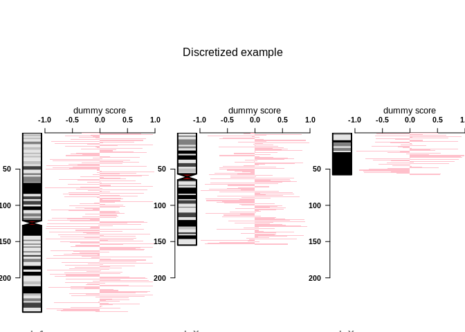

## R Markdown

This is an R Markdown document. Markdown is a simple formatting syntax for authoring HTML, PDF, and MS Word documents. For more details on using R Markdown see <http://rmarkdown.rstudio.com>.

When you click the **Knit** button a document will be generated that includes both content as well as the output of any embedded R code chunks within the document. You can embed an R code chunk like this:


```r
require(IdeoViz)
require(RColorBrewer)
```


```r
data(binned_multiSeries)
ideo <- getIdeo("hg18")
head(ideo)
```

```
##   chrom chromStart chromEnd   name gieStain
## 1  chr1          0  2300000 p36.33     gneg
## 2  chr1    2300000  5300000 p36.32   gpos25
## 3  chr1    5300000  7100000 p36.31     gneg
## 4  chr1    7100000  9200000 p36.23   gpos25
## 5  chr1    9200000 12600000 p36.22     gneg
## 6  chr1   12600000 16100000 p36.21   gpos50
```

```r
plotOnIdeo(chrom=seqlevels(binned_multiSeries), # which chrom to plot?
           ideoTable=ideo, # ideogram name
           values_GR=binned_multiSeries, # data goes here
           value_cols=1, # col to plot
           col=brewer.pal(n=5, 'Spectral'), # colours
           val_range=c(0,3),
           plotType = 'rect', # set y-axis range
           ylab="array intensities",
           plot_title="Trendline example")
```

<!-- -->


```r
summary(cars)
```

```
##      speed           dist       
##  Min.   : 4.0   Min.   :  2.00  
##  1st Qu.:12.0   1st Qu.: 26.00  
##  Median :15.0   Median : 36.00  
##  Mean   :15.4   Mean   : 42.98  
##  3rd Qu.:19.0   3rd Qu.: 56.00  
##  Max.   :25.0   Max.   :120.00
```

## Including Plots

You can also embed plots, for example:

<!-- -->

Note that the `echo = FALSE` parameter was added to the code chunk to prevent printing of the R code that generated the plot.
